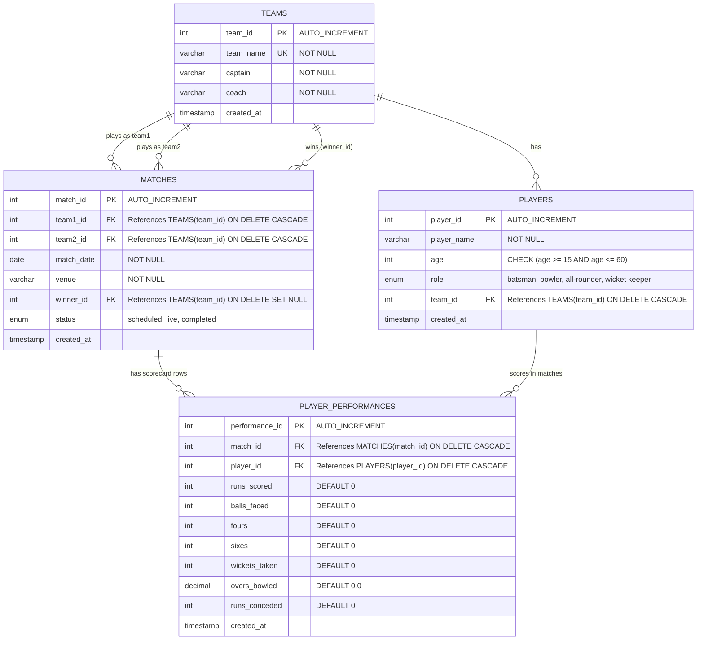

# Cricket Score Card Management System ER Diagram

The database schema is designed in **3rd Normal Form (3NF)** to avoid redundancy and maintain transactional integrity. It maps Teams, Players, Matches, and Player Performances (Scorecard).

## Relationships Description
1. **TEAMS to PLAYERS (1:N)**: A team can have multiple players. Each player belongs to exactly one team. `team_id` in `PLAYERS` is a foreign key referencing `TEAMS(team_id)`.
2. **TEAMS to MATCHES (1:N)**: A team plays in multiple matches (either as `team1_id` or `team2_id`). A match can also have a `winner_id` which references the team that won (or NULL if it was a draw/tie/not yet completed).
3. **MATCHES to PLAYER_PERFORMANCES (1:N)**: A match has many player performance records (scorecard details).
4. **PLAYERS to PLAYER_PERFORMANCES (1:N)**: A player can have performance entries across different matches they played in.
5. **PLAYER_PERFORMANCES Unique Key**: The combination of `(match_id, player_id)` is defined as a `UNIQUE KEY` to ensure a player can only have one batting/bowling performance record per match.
